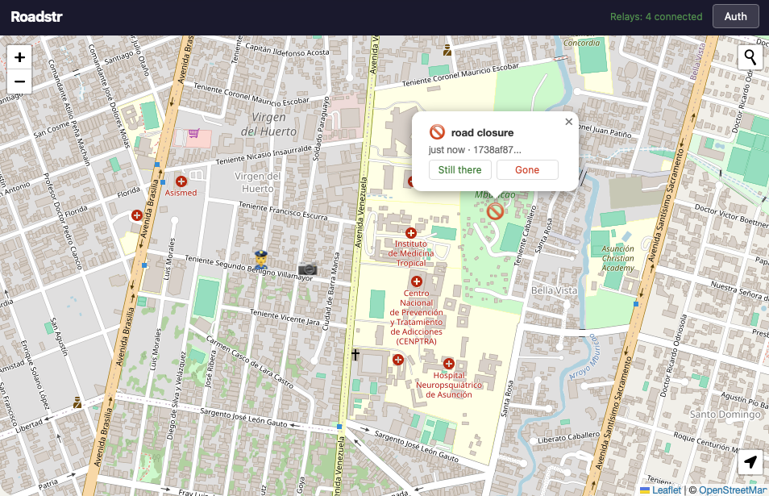
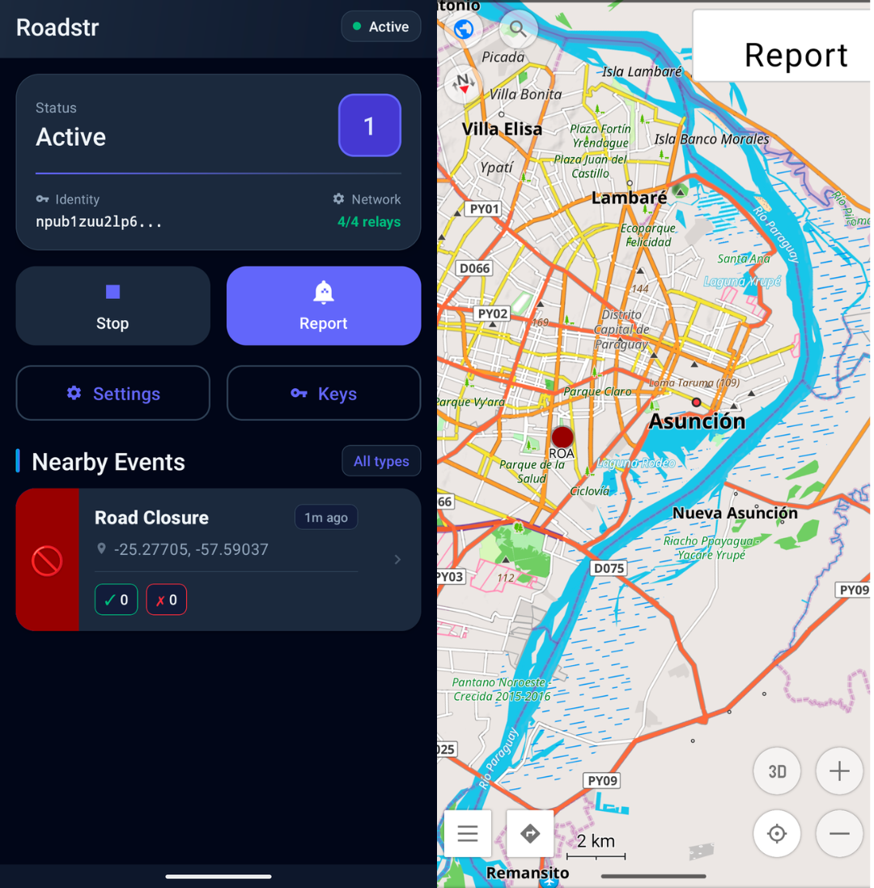

# Roadstr

**A decentralized road event reporting system — "Waze without the centralized tracking"**

Roadstr allows drivers to report and view road events (police, accidents, construction, hazards) using the Nostr protocol. Events are cryptographically signed, verifiable, and shared across a decentralized network of relays. No central authority, no tracking, no data harvesting.

### [Web Version](https://cypherpunk.today/static/roadstr)



### Android Version



Left: Android app, Right: OsmAnd integration showing events and Report button

## Features

- **Decentralized**: Events published to Nostr relays, no central server
- **Verifiable**: All events cryptographically signed with secp256k1 Schnorr signatures
- **Privacy-aware**: Use persistent identity or ephemeral keys per event
- **Mesh-ready**: Compact binary format (110-134 bytes) designed for MeshCore transport (specified, not yet implemented)
- **Android + Web**: OsmAnd plugin for in-car navigation, browser interface for browsing

### Event Types

Police, speed cameras, traffic jams, accidents, road closures, construction, hazards, road conditions, potholes, fog, ice, animals, and custom events.

### Confirmation System

Drivers can confirm ("still there") or deny ("no longer there") existing reports. Events automatically expire based on type (1 hour for traffic jams, 30 days for speed cameras, etc.).

## How It Works

Events are published as Nostr events (kind 1315 for reports, 1316 for confirmations) with geohash tags for efficient spatial querying. The protocol is designed to work both over internet (Nostr relays) and off-grid mesh networks (MeshCore). Mesh nodes can bridge between networks, allowing internet-connected users to publish events received via mesh, and vice versa.

## Platforms

### Web

Zero-build vanilla JavaScript interface with Leaflet maps, using OpenFreeMap vector tiles by default and automatic raster fallback during map startup failures. View events, report new ones, and confirm/deny existing reports. Works with NIP-07 browser extensions (Alby, nos2x) or generates ephemeral keys.

### Android (OsmAnd Plugin)

Integrates directly with the OsmAnd navigation app via AIDL. Events appear as color-coded markers on your route. Proximity alerts warn you when approaching reports (500m ahead). Report events with a quick-action widget while driving.

## How to Try

**Web version**: [Try it online](https://cypherpunk.today/static/roadstr)

**Android APK**: Available in [GitHub Releases](https://github.com/jooray/roadstr/releases)

(Requires OsmAnd app installed to view)

## Architecture

- **Android**: Kotlin, service-based architecture with foreground service, WebSocket relay connections, geohash-based queries, AIDL integration with OsmAnd
- **Web**: Vanilla JS, no build system, Leaflet maps with configurable OpenFreeMap vector or legacy raster basemaps, nostr-tools
- **Protocol**: Nostr events (NIP-01) with multi-level geohash tags, NIP-40 expiration, compact binary encoding for mesh

Both platforms share the same event format and remain compatible.

## Building

### Android

```bash
cd roadstr-android
export JAVA_HOME="/Applications/Android Studio.app/Contents/jbr/Contents/Home"
./gradlew assembleDebug
```

APK output: `app/build/outputs/apk/debug/app-debug.apk`

### Web

No build required. Open `roadstr-web/index.html` in a browser. Basemap mode is configured in `roadstr-web/js/config.js`: set `MAP_DISPLAY_CONFIG.mode` to `'vector'` (default OpenFreeMap) or `'raster'` (legacy Leaflet raster tiles). In vector mode, change `MAP_DISPLAY_CONFIG.vector.style` or `styleUrl` to switch the OpenFreeMap style source.

## Protocol

Roadstr uses two new Nostr event kinds:

- **Kind 1315**: Road event reports (police, accidents, hazards, etc.)
- **Kind 1316**: Confirmations/denials of existing reports

Events include geohash tags at multiple precision levels (4, 5, 6 characters) for efficient spatial querying. The compact binary encoding (110-134 bytes) enables future mesh network transport while preserving cryptographic verifiability.

See `nips/roadstr.md` for the draft NIP specification.

## Documentation

- `SPECIFICATION.md` — Complete technical specification (~900 lines)
- `nips/roadstr.md` — Draft NIP for kinds 1315/1316 (ready for submission to nostr-protocol/nips)
- `reference/osmand-aidl.md` — OsmAnd plugin API documentation

## Support and Value4Value

If you like this project, I would appreciate if you contributed time, talent, or treasure.

**Time and talent** can be donated in testing it out, fixing bugs, or submitting pull requests.

**Treasure** can be [donated here](https://juraj.bednar.io/en/support-me/).

## License

[Unlicense](https://unlicense.org/) — Public Domain

## Author

Juraj Bednár
